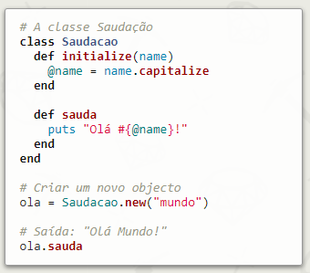
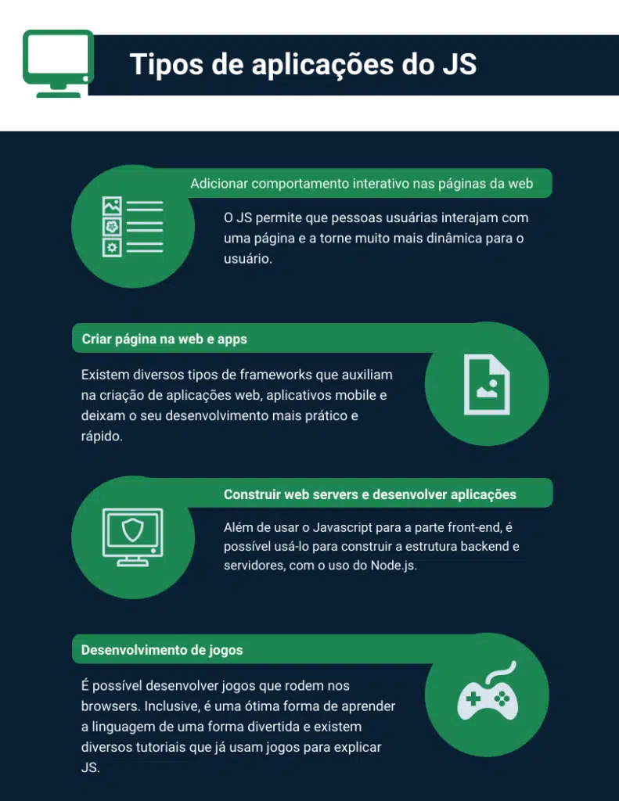
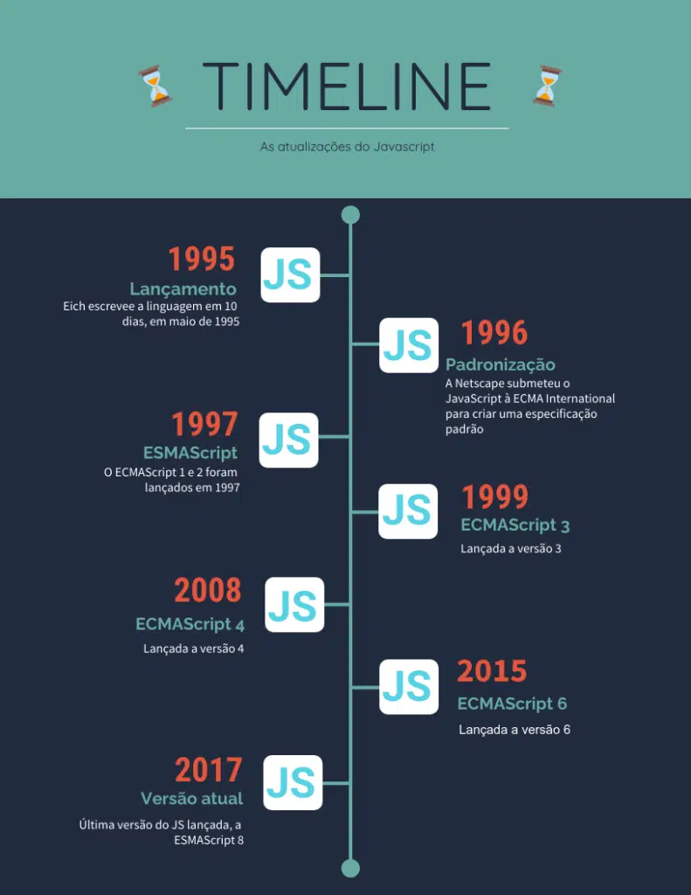

## Tarefa 005 - 10/06/2022 - Linguagens de Programação

Elaborar um pesquisa sobre linguagens de programação, abordar de forma
generalizada os aspectos de pelo menos 5 linguagens. Abordar de forma mais
específica as características de uma linguagem de sua preferência. Pode ser uma
das cinco ou não.

# LUA

Foi criada em uma universidade **Brasileira!**

É muito popular no mundinho de desenvolvimento de jogos.

### Mas e uma definição formal? Os seus paradigmas?

Lua é uma linguagem de programação poderosa, eficiente e leve, projetada para
estender aplicações. Ela permite programação procedural, programação orientada a
objetos, programação funcional, programação orientada a dados e descrição de
dados.

Ref. para começar:
https://www.luiztools.com.br/post/introducao-a-linguagem-de-programacao-lua/

# Java

Muita gente (eu incluso) acha Java uma linguagem velha e antiquada. Porém, é
preciso reconhecer que ela é extremamente versátil e útil no nosso mundo!

Java é uma das linguagens de programação mais usadas no mundo, segundo o famoso
ranking da TIOBE. É uma linguagem orientada a objetos, multiplataforma e
bastante completa por permitir a criação de um programa único para uso em
diversas plataformas. A plataforma Java ganhou muitos mercados diferentes - da
web ao desktop em grandes empresas e governos, passando por mobile e IoT mas o
grande mercado Java hoje ainda é o back-end em sistemas Web.

# Ruby

Essa está na minha lista de linguagens que quero dominar!

De acordo com o site dessa linguagem: **Ruby** é uma linguagem dinâmica, open
source com foco na simplicidade e na produtividade. Tem uma sintaxe elegante de
leitura natural e fácil escrita.

Um exemplo de código Ruby:

# TypeScript

No site você consegue encontraressa definição: TypeScript is a strongly typed
programming language that builds on JavaScript, giving you better tooling at any
scale.

Mas eu gosto de resumir com: O TypeScript dá mais confiança para programar com
JavaScript. Faz isso adicionando tipagem!

Muita gente também usa o tempo "SUPERSET do JavaScript" que é uma palavra legal
para se jogar numa conversa! Isso quer dizer que pega o JavaScript é dá SUPER
poderes a linguagem...mas eu acho que dá superpoderes para quer utiliza ela.
Especialmente porque a pessoa não se irritará tanto programando.

Tá, mas o que É JAVASCRIPT?? Essa é a linguagem que escolhi ir mais fundo nessa
pesquisa:

# JavaScript

Essa eu domino! Trabalho com ela desde 2018.

### Popularidade

Javascript é a linguagem mais popular da programação, segundo o estudo do site
StackOverFlow. E, desde 2013, a linguagem criada pelo programador Brendan Eich
há duas décadas se mantém no topo do ranking.

### Mas por que tanta popularidade?

1. É SUPER fácil de começar!
2. Tem uma comunidade GIGANTE.
3. Está em TODO lugar...pode ser utilizada no navegador, nos servidores, em
   aparelhos embarcados e etc...

Sua popularidade é decorrente do fato de ela ser uma linguagem extremamente
flexível e multifacetada, fazendo com que milhares de pessoas desenvolvedoras se
interessassem por ela, inclusive para escrever os primeiro códigos.

### Origem

Origem do JS O Javascript foi criado em 1995 pelo programador Brendan Eich.
Naquela época, o nome de batismo foi Mocha e, logo depois, passou a ser
conhecido por LiveScript.

No entanto, uma jogada de marketing marcou a criação da linguagem. No final de
1995, com a ascensão da linguagem Java no mundo da progração, o fundador da
linguagen resolveu mudar o nome para algo que fosse sonoramente parecido. Nasceu
assim, o Javascript.

Com o Javascript, a internet pode ficar mais dinâmica, com mais interações em
uma página, diversos tipos de interações, animações, entre várias outras coisas.
O primeiro navegador que começou a ter suporte para JS foi o Netscape.

### Para que serve?

### Linha do tempo

